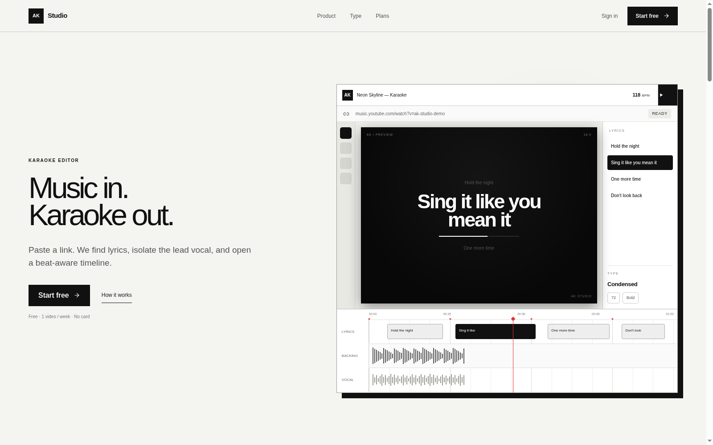
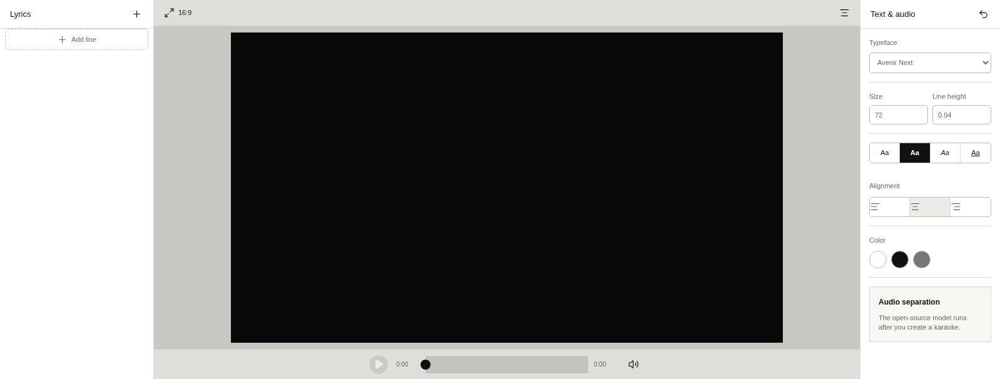

# AK Studio

**De un enlace de YouTube / YouTube Music a un proyecto de karaoke editable en el navegador.**

Web app en evolución: pegas un enlace, obtienes metadatos y letras sincronizables, y editas tipografía y timeline. Orientada a crear karaoke con el menor fricción posible — honestamente, aún no es un producto de exportación completa en producción.

**Demo en vivo:** [https://ak-studio.josanager.workers.dev](https://ak-studio.josanager.workers.dev)

---

## Capturas

| Landing | Studio / editor |
| --- | --- |
|  |  |

---

## Qué es

AK Studio convierte un enlace público de **YouTube** o **YouTube Music** en un **proyecto de karaoke editable**: metadatos, letra (LRCLIB), sincronización en línea de tiempo y tipografía.

La UI orientada al usuario está en **inglés**. Diseño monocromático, minimalista.

## Para qué sirve / objetivo

- Pegar un enlace → ver título, artista y miniatura.
- Cargar o generar clips de letra en el timeline (LRC sincronizado o sync inicial uniforme editable).
- Ajustar texto, tiempo, tipografía, tamaño, alineación, color y relación de aspecto (16:9 / 9:16 / 1:1).
- Autenticación con Google; planes Free / Pro visibles (límites y billing aún en camino).

El objetivo de producto a largo plazo es llegar de enlace a vídeo de karaoke descargable con poca intervención, manteniendo control fino sobre letra, tiempo y tipografía. **Esa exportación completa aún no está operativa en el demo público.**

## Stack

| Capa | Tecnología |
| --- | --- |
| App | TypeScript, React / Next-ish vía **vinext** |
| Runtime | **Cloudflare Workers** |
| Datos | **D1** (usuarios, sesiones, tipografías, uso) |
| Media temporal | **R2** (+ cola de procesamiento) |
| Auth | **Better Auth** + Google OAuth |
| Pagos | **Stripe** preparado (checkout path; no live en prod) |
| Procesador (previsto) | Servicio Python / GPU (BS-RoFormer, etc.) — no desplegado aún en el demo |

Más detalle: [PRODUCT.md](PRODUCT.md) · [PROJECT_STATUS.md](PROJECT_STATUS.md) · [CLOUDFLARE.md](CLOUDFLARE.md)

---

## Qué funciona hoy vs en progreso

### Demoable hoy (sólido)

- Landing pública responsive + editor protegido en `/studio`.
- Análisis de enlace YouTube / YouTube Music → metadatos + letras (LRCLIB) → clips en timeline.
- Editor: playhead, clips movibles, BPM markers, zoom, tipografía, aspectos de canvas.
- Google OAuth (Better Auth), cuenta, planes Free/Pro en UI, límite semanal Free en backend.
- Deploy en Cloudflare Workers + D1 + R2 + Queue enlazados.

### En evolución (no anunciar como “listo en producción”)

- **Separación real de audio / procesador GPU** — el path existe, pero el procesador no está conectado en el sitio público (`GPU_PROCESSOR_URL`). Sin él no hay descarga ni stems en el demo.
- **Exportación final de vídeo** — botón/UI presentes; falta render FFmpeg + watermark Free + descarga.
- **Stripe de producción** — checkout preparado; faltan producto/precio/secretos/webhook.
- Separación premium (Moises/Music.ai), dominio custom, rate limits / observabilidad a escala.

> Resumen honesto: el pitch del demo es **análisis de enlace + editor de letras/timeline**. No es todavía “karaoke export completo en producción”.

---

## Cómo ejecutar (local)

Requiere **Node.js ≥ 22.13**.

```bash
npm ci          # o: npm run install:ci
npm run dev     # preview local (vinext; suele ser http://localhost:5173)
```

Otras scripts útiles:

```bash
npm run build:cloudflare
npm run deploy:cloudflare
npm run db:migrate:cloudflare
```

Secretos y bindings: ver [CLOUDFLARE.md](CLOUDFLARE.md) y `.dev.vars.example`. No commits de secretos.

---

## Estado y continuidad

El documento vivo del proyecto es **[PROJECT_STATUS.md](PROJECT_STATUS.md)** (qué hay, qué falta, cómo verificar y desplegar). Alcance de producto: **[PRODUCT.md](PRODUCT.md)**.

---

*Portfolio / WIP — Josan Ager · [josanager](https://github.com/josanager)*
